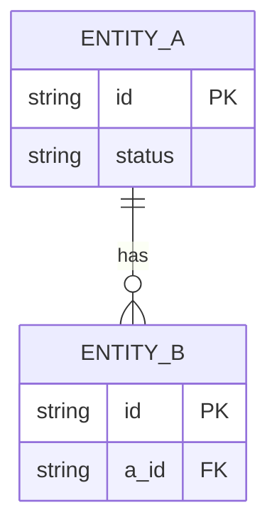

# System Design Document (SDD) — <product>

> The **single source of truth** for one product's architecture: the Solution Architecture Document
> (`project-governance.md` artefact #1) assembled from artefacts #1–#8. **Assemble, don't duplicate** —
> each section links the authoritative doc (PRD / ADR / SPEC) and summarises it. Lives at
> `<repo>/docs/architecture/solution-architecture.md`. Path‑C (new product / major initiative); scale
> down for smaller work. Docs‑as‑code: Markdown + Mermaid in Git. References: retrieva + ktayl-core.

- **Product / repo(s):** · **Owner (SA/TL):** · **Status:** draft | reviewed | as‑built · **Date:**
- **Delivery path:** C (full) | B (subset) · **Board:** #

## 1. Context & problem (why this exists)
One paragraph: the business problem + where this sits in the ktayl‑solution IS. → links the PRD / brief.

## 2. Requirements
### 2.1 Functional
The capabilities (bulleted or → link the PRD). 
### 2.2 Non‑functional (NFR register)
SLOs (latency/availability), scale, data volume/retention, **RTO/RPO**, security, observability, **cost/
footprint** (fits which namespace quota). → the measurable NFRs; the live targets live in
`reliability-and-gamedays.md` (SLO register).

## 3. System architecture (C4)
- **Context** (who/what it talks to) — mermaid `C4Context` or ASCII.
- **Container** (the deployable units + data stores + boundary ports) — mermaid/ASCII.
- **Deployment** (where it runs: ns, dev/prod, ingress, Kargo) — ASCII.
State the **boundaries** explicitly (what it owns vs integrates with).

## 4. Data design
- **Store choice + why** (Postgres/CNPG · schema‑per‑module · etc.).
- **ERD** — a mermaid `erDiagram` of the core entities + relationships.
- **Schema / migrations** — the migration tool (Flyway/Alembic) + strategy; money as integer minor‑units;
  append‑only/audit tables. → link the migrations dir.
- **Ownership + residency** — which data this product owns; PII class; where it must not leave.

## 5. API specification
- The committed contract → **`<repo>/api/openapi.yaml`** (link it).
- Per endpoint (the `documentation.md` rule): **auth · headers · request body + required fields ·
  validation errors · response shape · status codes · idempotency**.
- Inbound non‑SSO surfaces (webhooks) — how they're authenticated (signature) + made idempotent.
- Cross‑service contracts consumed → the L3 contract test that pins them (`testing.md`).

## 6. Operational & scaling strategy
- **Environments + promotion** — dev/prod, Kargo (git vs image Warehouse), CODEOWNERS gate (`gitops.md`).
- **Scaling** — replicas, KEDA/HPA, scale‑to‑zero; the latency target + how load is handled; caching (if any).
- **SLOs + error budget** — the service's row in the SLO register; the alerts.
- **Failure modes + rollback** — what happens when each dependency dies; the canary brake; the Game Day
  scenarios that exercise it (`reliability-and-gamedays.md`).
- **Backup / DR** — RTO/RPO + the restore drill.

## 7. Security & compliance
- AuthN/AuthZ (Authentik OIDC, group‑gated), secrets (ESO→Vault), network (default‑deny + governed egress).
- **Threat model** (STRIDE‑lite + mitigations) → link.
- **Compliance mapping** — DORA / GDPR / Solvency II / IFRS 17 / AI‑Act as applicable + the cert bloc.

## 8. Decision log (ADRs)
Index of the product's ADRs (id · title · status · the trade‑off it settled). → link `docs/architecture/adr/`.

## 9. Open questions / deferred
What's explicitly out of scope now + the revisit trigger (honest, not gaps).

---
**Keep it as‑built.** Update this in the same effort as the change (the `documentation.md` DoD gate).
Each section is evidence for the proof‑catalog (`evidence-and-proof.md`) + cert BC02/BC03.
